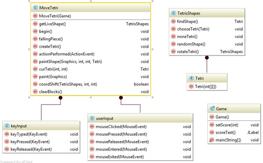

# Tetris Game

This repository contains an adaption of the Tetris game created using Java. 

The original Tetris game was released in 1984 in Russia, it is a tile matching game where if all the tiles match within a row the line is cleared and the player will receive a certain number of points.

The structure of my system is shown in the diagram below:  

The image shows all of the methods each class contains, the MoveTetri() class also contains the inner classes keyInput() and userInput(), and the TetrisShapes class also contains the inner class Tetri(). The main structure of my system is that there are three classes that send information to each other.  

* **MoveTetri()** - This class contains all the methods which receive information and alter the movement and placement of the tetromino’s within the frame. This class also paints the tetromino’s and contains the timer for when new tetromino’s are to fall and to paint the ones that have landed.  
* **TetrisShapes()** - This class contains all the coordinates for the  tetromino’s, this allows the MoveTetri() class to paint them to look and act like the original tetromino’s. As the coordinates are located here I added the rotation within this class too where the ‘y’ coordinates of each shape are flipped. This method sends a reference to each individual tetromino so the MoveTetri() class is aware of which coordinates belong to which shape.  
* **Game()** - This method creates the main frame on which the game runs, it calls the MoveTetri() class to add onto the frame the tetromino’s and set the grid of 20 by 10 blocks. This class also handles the score on the side of the frame.  

### Game Functionality 

When the main method from the Game() class is run a frame will appear on the centre of the screen. At the top of this frame is a main heading ‘Welcome to TETRIS!!’ to the right is the current score labelled ‘Score : “ plus the score. To the left of the score is the main box in which the game play occurs. Here the tetromino’s are randomly generated and fall from the centre at the top of the frame.  

There are two inner classes within my MoveTetri() class, these are the keyInput() and userInput() classes. The userInput() inner class waits for the player to push and release the mouse buttons. The left mouse button will move the tetromino shape to the left, the middle button will rotate the shape right by 90 degrees and the right mouse button will move the tetromino shape to the right. The keyInput() inner class is identical to userInput() however this method listens for keyboard input, here the left arrow key will move the tetromino left, the right arrow key will move the tetromino right and the up arrow key will rotate the tetromino. These will also only be implemented once the keyboard key is released. Additionally when the player pushes the down arrow, the tetromino will move an extra step down (-1 on top of the -1 it moves every 450 milliseconds), this allows the player to speed up game play if they are aware where the tetromino will fall. The keyboard functionality is an additional feature that I added to my Tetris game on top of the specification.  

The movement of the tetromino shapes to the left and right are restricted by the borders so once the tetromino has reached the border on each side the tetromino will no longer move, this is implemented within the coordShift() method within the MoveTetri() class.  

When a row is cleared during game play all top rows will shift one row down and the player will be awarded with 10 points per row cleared. Additionally I have added to the gameplay once the player clears 10 rows they will be awarded 30 points per row.  
When the player runs out of space and a tetromino can no longer fit on the screen the game is ended, this is done by showing the player behind the stack of tetromino’s a light grey version of the block that would have fallen, this is one of my shortcomings as I was unable to position it above the stack at the top to show exactly how it wouldn’t fit, but I still wanted to show the player what tetromino it would have been. Alongside this a dialogue box appears in the centre of the screen it states, ‘GAME OVER! Your Score Was: (score) Would You Like To Play Again?’, this tells the player their score and offers them the option of playing again, if the player selects ‘YES’, the game will restart and the score will be reset to 0. If the player selects ‘NO’, the game will be closed.  

